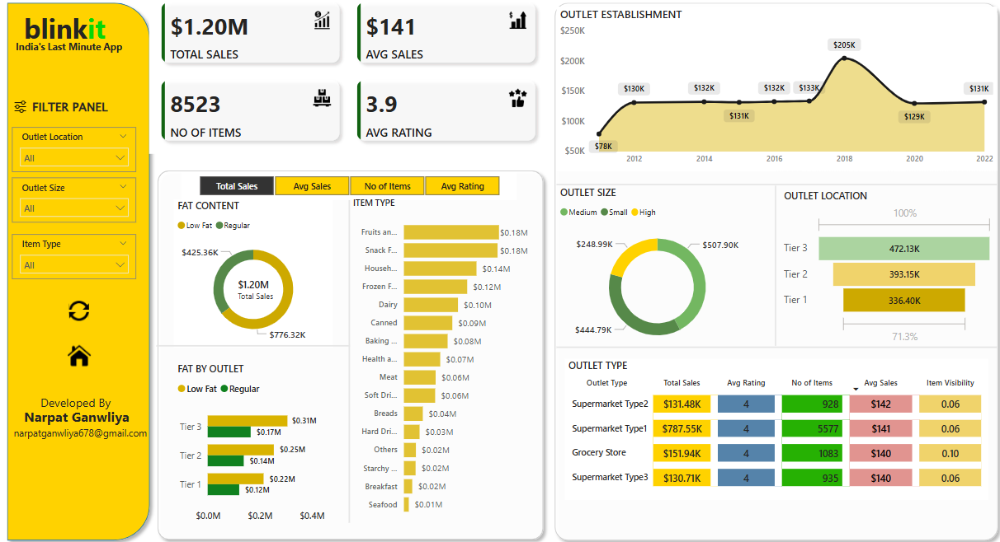
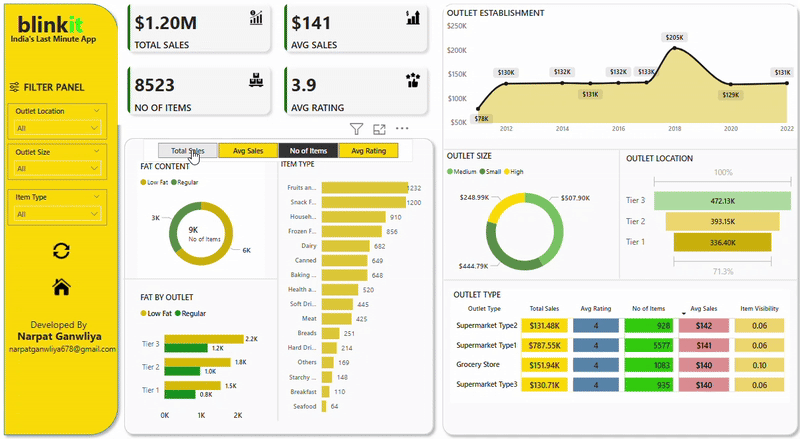

# 📊 Blinkit Sales Analysis Dashboard

Welcome to my Power BI project that dives deep into Blinkit's retail sales data. This interactive dashboard offers a comprehensive analysis of sales performance across various dimensions like outlet type, size, location, item categories, and fat content.

---

## 🔍 Project Overview

**Objective:**  
To analyze Blinkit's sales data and derive actionable insights using an interactive and visually appealing Power BI dashboard.

**Key Features:**
- Total sales, average sales, item count, and average ratings overview
- Sales breakdown by:
  - Outlet location and size
  - Item type and fat content
  - Outlet type and rating
- Time-series view of outlet establishments over the years
- Drill-down filters for customized insights

---

## 📁 Dataset

- **Type:** Retail sales data (mock or anonymized)
- **Key Fields:** Outlet Type, Item Type, Outlet Location, Sales, Ratings, Item Fat Content, Year of Establishment
- **Tool Used:** Power BI

> *Note: The dataset used here is for demonstration and learning purposes.*

---

## 📊 Visual Insights

- 🥑 **Top Selling Categories:** Fruits and Snacks lead in sales.
- 🏪 **Best Performing Outlet Type:** Supermarket Type1 with highest total sales.
- 🧈 **Fat Content Trend:** Regular items sell more but low-fat trends are noticeable.
- 🌍 **Top Outlet Location:** Tier 3 cities contribute the highest sales.

---

## ⚙️ Tools & Technologies

- **Power BI Desktop**
- **DAX & Power Query**
- **Data Visualization & Dashboard Design**

---

## 📽 Demo Preview

> ## 🎥 Live Dashboard Demo

---

## 🚀 How to Use

1. Download the `.pbix` file from this repo.
2. Open it in [Power BI Desktop](https://powerbi.microsoft.com/desktop/).
3. Interact with the filters and visuals to explore insights.

---

## 🙋‍♂️ About Me

Developed by: **Narpat Ganwliya**  
📧 narpatganwliya678@gmail.com  
🔗 [LinkedIn Profile](https://www.linkedin.com/in/narpat-ganwliya)

---

## ⭐ If you like this project

Don't forget to:
- 🌟 Star this repo
- 🍴 Fork it
- 📝 Share your thoughts and feedback

---

